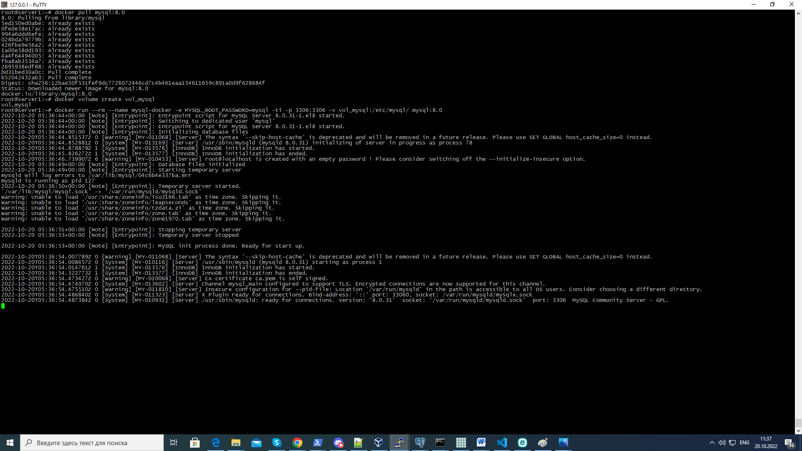
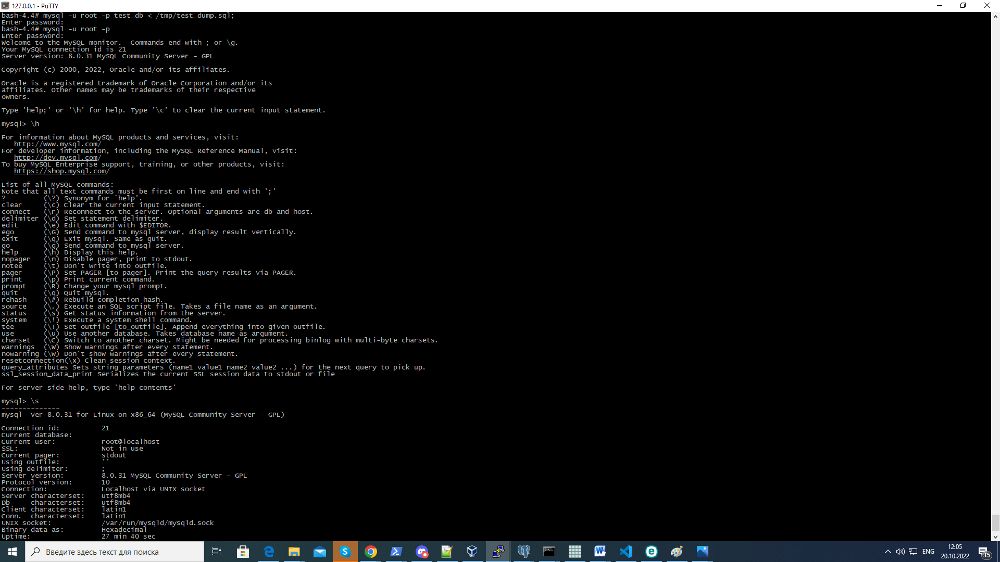
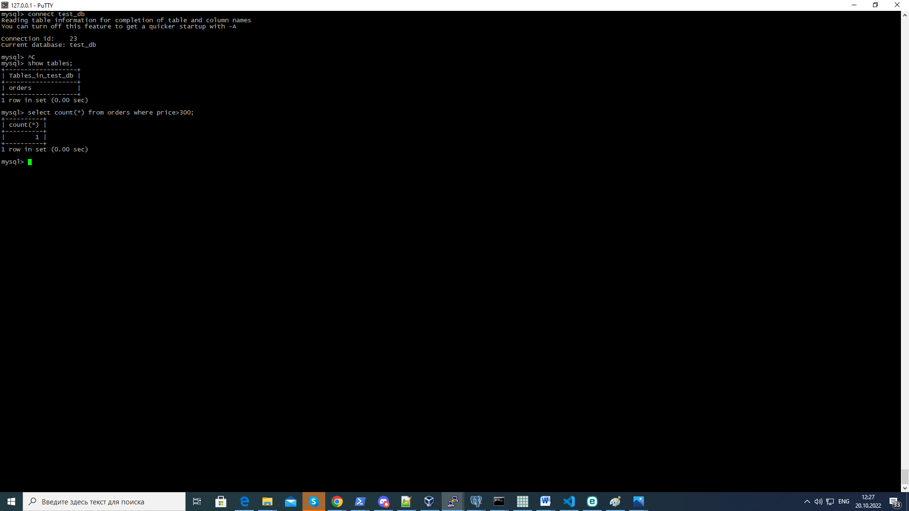
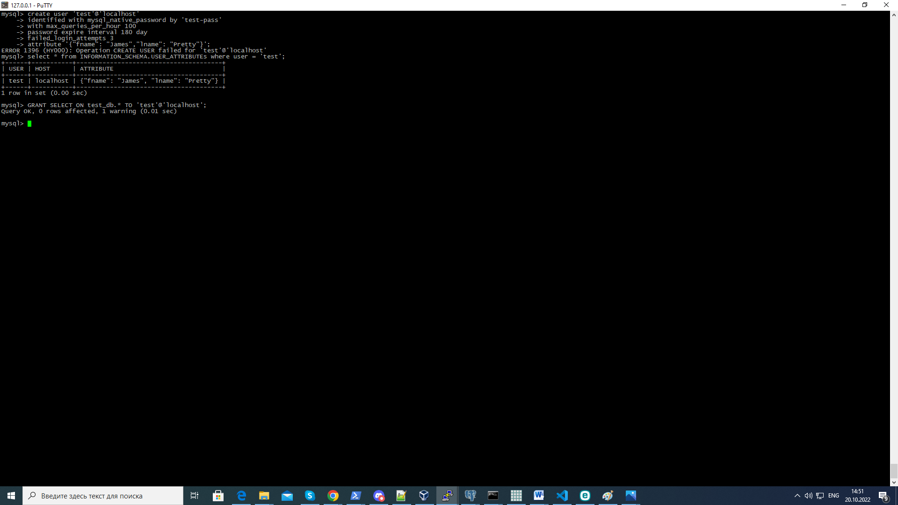
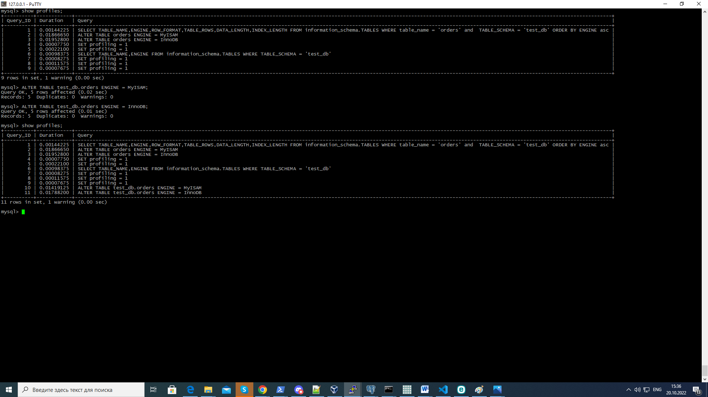

# Домашнее задание к занятию "6.3. MySQL"

## Задача 1

Используя docker поднимите инстанс MySQL (версию 8). Данные БД сохраните в volume.
```
root@server1:~# docker pull mysql:8.0
root@server1:~# docker volume create vol_mysql
root@server1:~# docker run --rm --name mysql-docker -e MYSQL_ROOT_PASSWORD=mysql -ti -p 3306:3306 -v vol_mysql:/etc/mysql/ mysql:8.0
```
Изучите [бэкап БД](https://github.com/netology-code/virt-homeworks/tree/master/06-db-03-mysql/test_data) и 
восстановитесь из него.
```
bash-4.4# mysql -u root -p test_db < /tmp/test_dump.sql;
```
Перейдите в управляющую консоль `mysql` внутри контейнера.
```
bash-4.4# mysql -u root -p
```
Используя команду `\h` получите список управляющих команд.

Найдите команду для выдачи статуса БД и **приведите в ответе** из ее вывода версию сервера БД.
```
mysql> \s
```
Подключитесь к восстановленной БД и получите список таблиц из этой БД.
```
mysql> connect test_db
```
**Приведите в ответе** количество записей с `price` > 300.
```
mysql> select count(*) from orders where price>300;
```
В следующих заданиях мы будем продолжать работу с данным контейнером.

# Ответ:




## Задача 2

Создайте пользователя test в БД c паролем test-pass, используя:
- плагин авторизации mysql_native_password
- срок истечения пароля - 180 дней 
- количество попыток авторизации - 3 
- максимальное количество запросов в час - 100
- аттрибуты пользователя:
    - Фамилия "Pretty"
    - Имя "James"
    
Ответ:

создание пользователя
```
create user 'test'@'localhost' 
    identified with mysql_native_password by 'test-pass' 
    with max_queries_per_hour 100
    password expire interval 180 day 
    failed_login_attempts 3 
    attribute '{"fname": "James","lname": "Pretty"}';
```

Предоставьте привелегии пользователю `test` на операции SELECT базы `test_db`.
```
mysql> grant select on test_db. to test@'localhost';
mysql> flush privileges;
```    
Используя таблицу INFORMATION_SCHEMA.USER_ATTRIBUTES получите данные по пользователю `test` и 
**приведите в ответе к задаче**.
```
mysql> select * from INFORMATION_SCHEMA.USER_ATTRIBUTEs where user = 'test';
```


## Задача 3

Установите профилирование `SET profiling = 1`.
Изучите вывод профилирования команд `SHOW PROFILES;`.
```
mysql> show profiles;
+----------+------------+--------------------------------------------------------------------------------------------------------------------------------------------------------------------------------------+
| Query_ID | Duration   | Query                                                                                                                                                                                |
+----------+------------+--------------------------------------------------------------------------------------------------------------------------------------------------------------------------------------+
|        1 | 0.00144225 | SELECT TABLE_NAME,ENGINE,ROW_FORMAT,TABLE_ROWS,DATA_LENGTH,INDEX_LENGTH FROM information_schema.TABLES WHERE table_name = 'orders' and  TABLE_SCHEMA = 'test_db' ORDER BY ENGINE asc |
|        2 | 0.01866650 | ALTER TABLE orders ENGINE = MyISAM                                                                                                                                                   |
|        3 | 0.01952800 | ALTER TABLE orders ENGINE = InnoDB                                                                                                                                                   |
|        4 | 0.00007750 | SET profiling = 1                                                                                                                                                                    |
|        5 | 0.00022100 | SET profiling = 1                                                                                                                                                                    |
|        6 | 0.00098375 | SELECT TABLE_NAME,ENGINE FROM information_schema.TABLES WHERE TABLE_SCHEMA = 'test_db'                                                                                               |

+----------+------------+--------------------------------------------------------------------------------------------------------------------------------------------------------------------------------------+

```
Исследуйте, какой `engine` используется в таблице БД `test_db` и **приведите в ответе**.
```
mysql> SELECT TABLE_NAME,ENGINE FROM information_schema.TABLES WHERE TABLE_SCHEMA = 'test_db';
+------------+--------+
| TABLE_NAME | ENGINE |
+------------+--------+
| orders     | InnoDB |
+------------+--------+
1 row in set (0.00 sec)

```
Измените `engine` и **приведите время выполнения и запрос на изменения из профайлера в ответе**:
- на `MyISAM`
- на `InnoDB`
```
0.01419125 | ALTER TABLE test_db.orders ENGINE = MyISAM                                                                                                                  
0.01788200 | ALTER TABLE test_db.orders ENGINE = InnoDB  
```



## Задача 4 

Изучите файл `my.cnf` в директории /etc/mysql.

Измените его согласно ТЗ (движок InnoDB):
- Скорость IO важнее сохранности данных
- Нужна компрессия таблиц для экономии места на диске
- Размер буффера с незакомиченными транзакциями 1 Мб
- Буффер кеширования 30% от ОЗУ
- Размер файла логов операций 100 Мб

Приведите в ответе измененный файл `my.cnf`.

---

### Как оформить ДЗ?

Выполненное домашнее задание пришлите ссылкой на .md-файл в вашем репозитории.

---
