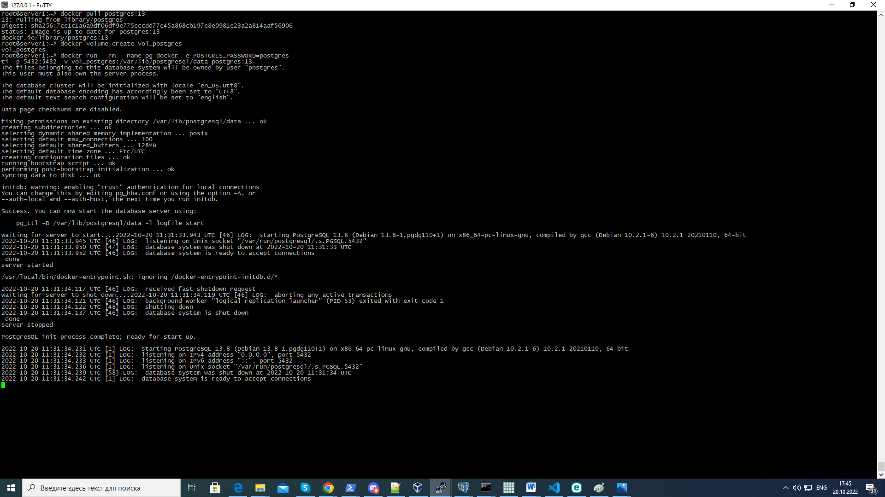
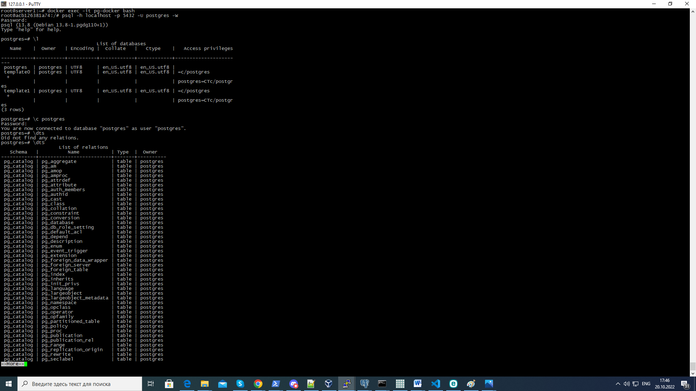
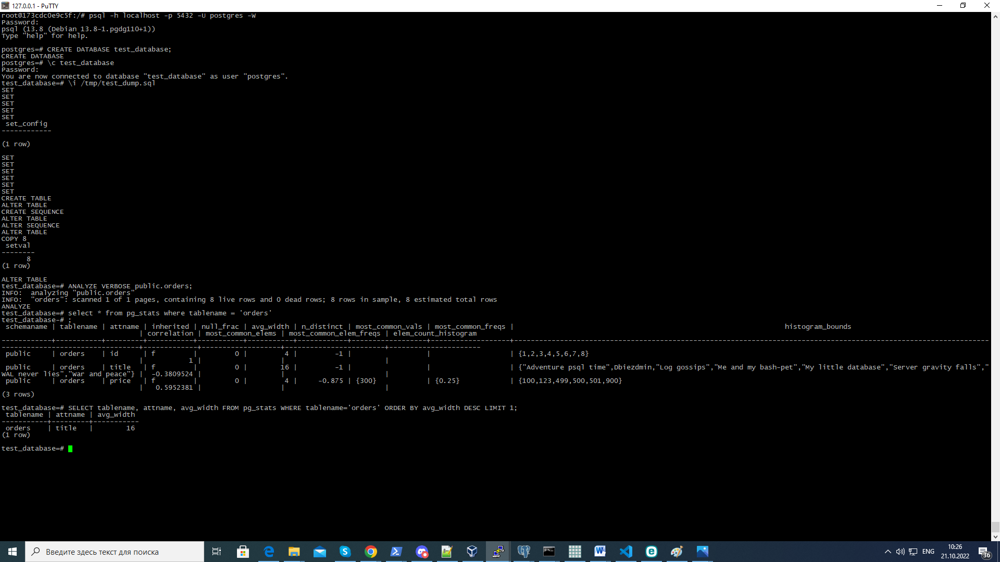

# Домашнее задание к занятию "6.4. PostgreSQL"

## Задача 1

Используя docker поднимите инстанс PostgreSQL (версию 13). Данные БД сохраните в volume.

```
root@server1:~# docker pull postgres:13
root@server1:~# docker volume create vol_postgres
root@server1:~# docker run --rm --name pg-docker -e POSTGRES_PASSWORD=postgres -ti -p 5432:5432 -v vol_postgres:/var/lib/postgresql/data postgres:13
root@server1:~# docker exec -it pg-docker bash
```

Подключитесь к БД PostgreSQL используя `psql`.
```
root@acb126381a74:/# psql -h localhost -p 5432 -U postgres -W
```
Воспользуйтесь командой `\?` для вывода подсказки по имеющимся в `psql` управляющим командам.

**Найдите и приведите** управляющие команды для:
```
- вывода списка БД                    postgres=# \l
- подключения к БД                    postgres=# \c
- вывода списка таблиц                postgres-# \dt
- вывода описания содержимого таблиц  postgres-# \d[S+] NAME
- выхода из psql                      postgres-# \q
```


## Задача 2

Используя `psql` создайте БД `test_database`.

Изучите [бэкап БД](https://github.com/netology-code/virt-homeworks/tree/master/06-db-04-postgresql/test_data).

Восстановите бэкап БД в `test_database`.

Перейдите в управляющую консоль `psql` внутри контейнера.

Подключитесь к восстановленной БД и проведите операцию ANALYZE для сбора статистики по таблице.

Используя таблицу [pg_stats](https://postgrespro.ru/docs/postgresql/12/view-pg-stats), найдите столбец таблицы `orders` 
с наибольшим средним значением размера элементов в байтах.

**Приведите в ответе** команду, которую вы использовали для вычисления и полученный результат.
Ответ:
```
postgres=# CREATE DATABASE test_database;
postgres=# \c test_database
test_database=# \i /tmp/test_dump.sql
test_database=# ANALYZE VERBOSE public.orders;
select * from pg_stats where tablename = 'orders'
schemaname | tablename | attname | inherited | null_frac | avg_width | n_distinct | most_common_vals | most_common_freqs |                                                                 histogram_bounds
                                 | correlation | most_common_elems | most_common_elem_freqs | elem_count_histogram
------------+-----------+---------+-----------+-----------+-----------+------------+------------------+-------------------+------------------------------------------------------------------------------------------------------------------
---------------------------------+-------------+-------------------+------------------------+----------------------
 public     | orders    | id      | f         |         0 |         4 |         -1 |                  |                   | {1,2,3,4,5,6,7,8}
                                 |           1 |                   |                        |
 public     | orders    | title   | f         |         0 |        16 |         -1 |                  |                   | {"Adventure psql time",Dbiezdmin,"Log gossips","Me and my bash-pet","My little database","Server gravity falls","
WAL never lies","War and peace"} |  -0.3809524 |                   |                        |
 public     | orders    | price   | f         |         0 |         4 |     -0.875 | {300}            | {0.25}            | {100,123,499,500,501,900}
                                 |   0.5952381 |                   |                        |
(3 rows)

SELECT tablename, attname, avg_width FROM pg_stats WHERE tablename='orders' ORDER BY avg_width DESC LIMIT 1;
tablename | attname | avg_width
-----------+---------+-----------
 orders    | title   |        16
(1 row)

```

## Задача 3

Архитектор и администратор БД выяснили, что ваша таблица orders разрослась до невиданных размеров и
поиск по ней занимает долгое время. Вам, как успешному выпускнику курсов DevOps в нетологии предложили
провести разбиение таблицы на 2 (шардировать на orders_1 - price>499 и orders_2 - price<=499).

Предложите SQL-транзакцию для проведения данной операции.
```
CREATE TABLE orders_1 (CHECK (price < 499)) INHERITS (orders);
CREATE TABLE orders_2 (CHECK (price >= 499)) INHERITS (orders);
```

Можно ли было изначально исключить "ручное" разбиение при проектировании таблицы orders?
да можно было
```
CREATE TABLE public.orders_new (
id integer NOT NULL,
title character varying(80) NOT NULL,
price integer DEFAULT 0
)
PARTITION BY RANGE (price);
```

## Задача 4

Используя утилиту `pg_dump` создайте бекап БД `test_database`.

Как бы вы доработали бэкап-файл, чтобы добавить уникальность значения столбца `title` для таблиц `test_database`?

---

### Как cдавать задание

Выполненное домашнее задание пришлите ссылкой на .md-файл в вашем репозитории.

---
